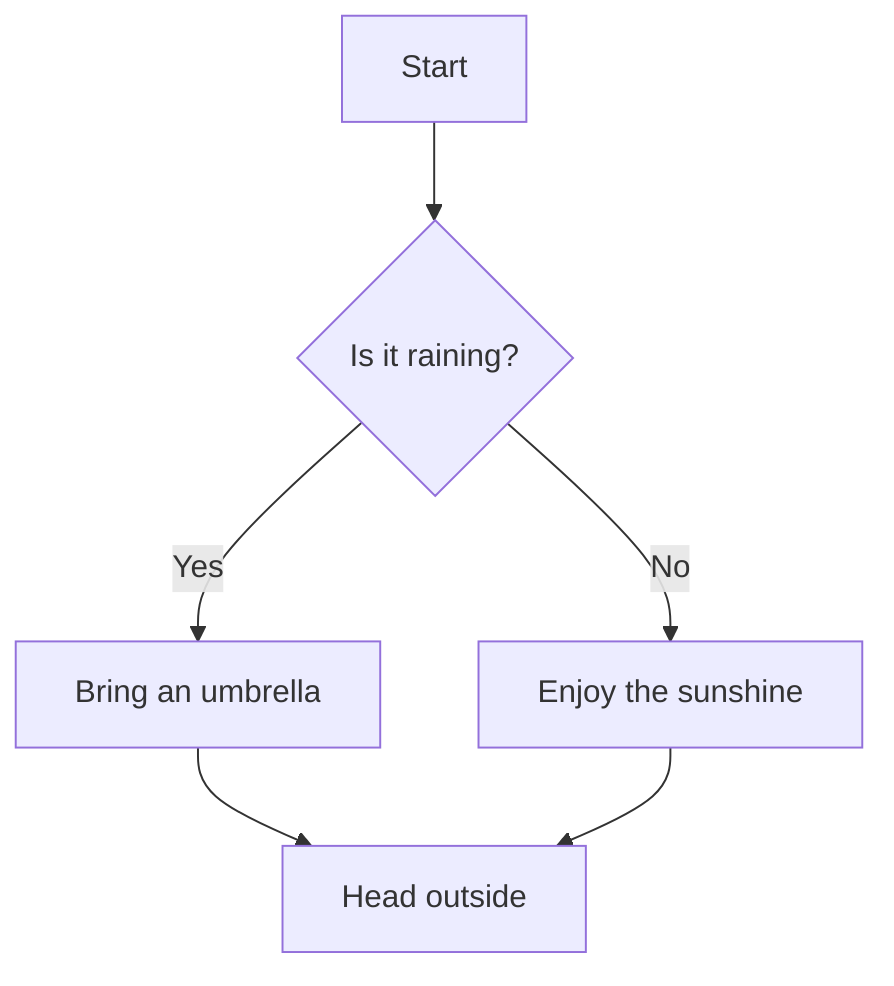
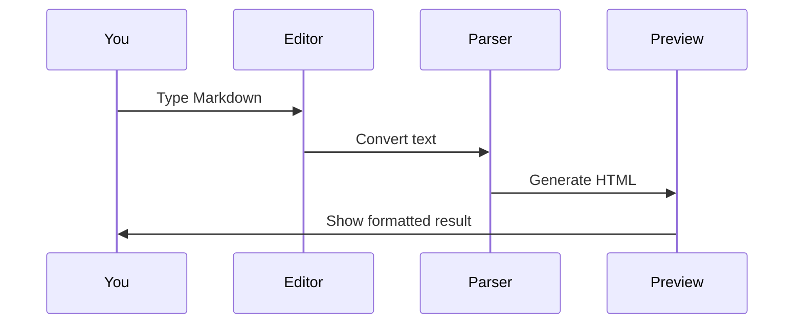

# Markdown Showcase
This editor supports rich text formatting using Markdown — a simple way to style your writing without complicated tools.

[toc]

---

## 1. Text Formatting
Make your text stand out with these basic styles.

Regular text, **bold text**, *italic text*, ***bold and italic***, ~~strikethrough~~, and `inline code`.

Superscript: X^2^, Subscript: H~2~O, ==highlighted text==.

---

## 2. Blockquote
Use blockquotes to highlight a quote or an important message.

> "Simplicity is the ultimate sophistication."
> — Leonardo da Vinci
>
> > You can also nest a quote inside another quote.

---

## 3. Lists
Organize your content into easy-to-read lists.

**Bullet List:**
- Apples
- Bananas
  - Cavendish
  - Plantain
- Oranges

**Numbered List:**
1. Wake up
2. Make coffee
   1. Boil water
   2. Pour over grounds
3. Start working

**Checklist — track your tasks:**
- [x] Buy groceries
- [x] Reply to emails
- [ ] Read a book
- [ ] Go for a walk

---

## 4. Code
Share code snippets with proper formatting and syntax highlighting.

Inline example: use `print("Hello")` to display output.

**JavaScript:**
```javascript
function greet(name) {
  return `Hello, ${name}!`;
}
console.log(greet("World"));
```

**Python:**
```python
def greet(name):
    return f"Hello, {name}!"

print(greet("World"))
```

**Terminal / Command Line:**
```bash
npm install markdown-it
npm run dev
```

---

## 5. Table
Present data in a structured, easy-to-compare format.

| Name    | Role      | Status       |
|---------|-----------|--------------|
| Alice   | Developer | ✅ Active    |
| Bob     | Designer  | ✅ Active    |
| Charlie | QA        | ⏳ On Leave  |
| Diana   | DevOps    | ❌ Inactive  |

---

## 6. Links & Images
Add clickable links and embed images directly in your document.

[Click here to visit Google](https://google.com)

[This link shows a tooltip on hover](https://google.com "Hello! I am a tooltip.")


---

## 7. Footnote
Add references or extra context without cluttering your main text.

The Eiffel Tower was built in 1889[^1] and stands 330 meters tall[^2].

[^1]: Construction began in 1887 and was completed in 1889 for the World's Fair.
[^2]: Including the broadcast antenna added to the top in 1957.

---

## 8. Definition List
Great for glossaries, FAQs, or explaining terms.

Markdown
: A simple way to format text using plain characters like `*`, `#`, and `-`.

Browser
: A program used to access and view websites, such as Chrome or Firefox.

---

## 9. Abbreviation
Hover over the highlighted words below to see their full meaning.

*[HTML]: HyperText Markup Language
*[CSS]: Cascading Style Sheets
*[JS]: JavaScript

Modern websites are built with HTML, CSS, and JS working together.

---

## 10. Callout Blocks
Draw attention to important information with color-coded callout blocks.

::: info
You can edit this document in the left panel and see the result instantly on the right.
:::

::: tip Pro Tip
Use Ctrl+S to quickly save your work at any time.
:::

::: warning Watch Out
Unsaved changes will be lost if you close the tab.
:::

::: danger Danger Zone
Deleting your document cannot be undone. Proceed with caution!
:::

::: note Side Note
Callout blocks are great for tutorials, documentation, and guides.
:::

---

## 11. Math Formulas
Write beautiful mathematical equations using LaTeX syntax.

Simple inline formula: $E = mc^2$

A more complex block formula:

$$
\sum_{i=1}^{n} i = \frac{n(n+1)}{2}
$$

$$
\int_{a}^{b} f(x)\,dx = F(b) - F(a)
$$

---

## 12. Diagrams
Create flowcharts and diagrams using simple text — no drawing tools needed.

**Flowchart — how a decision is made:**


**Sequence Diagram — how this editor works:**


---

## 13. Emoji
Add a bit of personality to your writing with emoji. 😊

Paste directly: 🚀 ✅ ⚠️ 💡 ❌ 📌 🎉 🔥

Or use shortcode syntax: :rocket: :white_check_mark: :bulb: :tada:

---

## 14. Inline HTML
For advanced formatting, raw HTML elements are supported.

Keyboard shortcut: <kbd>Ctrl</kbd> + <kbd>S</kbd> to save.

<mark>This sentence is highlighted using an HTML tag.</mark>

<details>
  <summary>📌 Click here to reveal hidden content</summary>
  <br>
  This section is collapsed by default. Click the title above to toggle it open or closed. Useful for FAQs, extra notes, or spoilers!
</details>

---

## 15. Escape Characters
Prevent Markdown from formatting a character by adding `\` before it.

Without escaping: **this is bold**

With escaping: \*\*this is not bold\*\*

Other examples: \# not a heading · \`not code\` · \[not a link\]

---

*Made with this editor — everything you see here was written in plain Markdown.*
